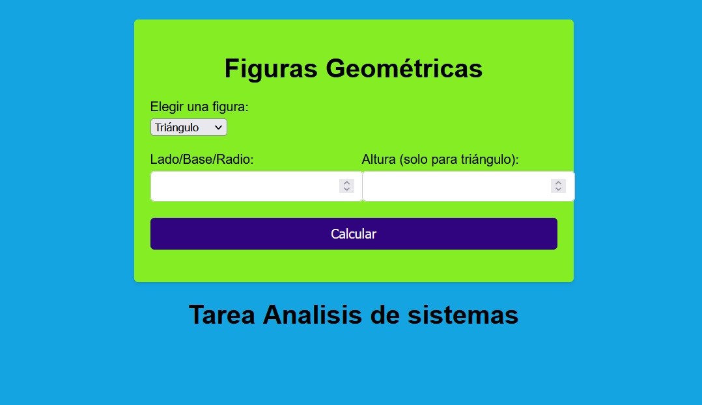
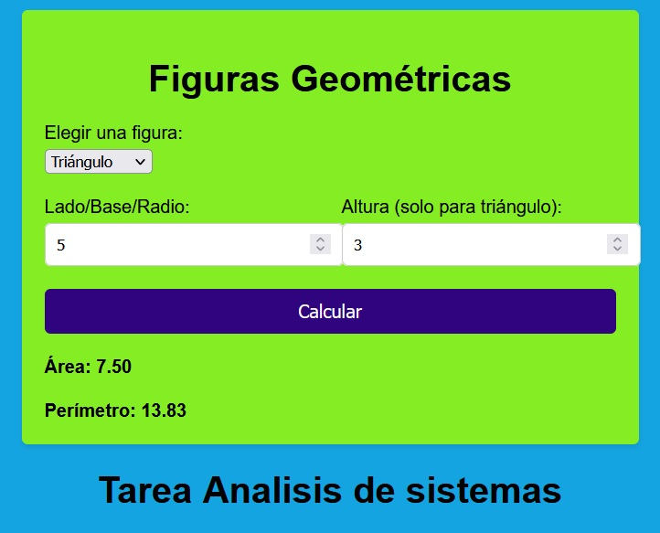
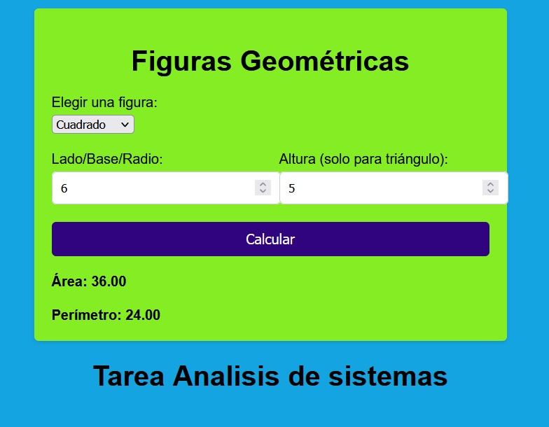

>UNIVERSIDAD MARIANO GALVEZ DE GUATEMALA             

>FACULTAD DE INGENIERIA EN SISTEMAS

>CENTRO REGIONAL BOCA DEL MONTE

>CURSO: ANALISIS DE SISTEMAS 1 SECCION “A”

>CATEDRATICO: ING. MELVIN CALI

#

# TAREA 5

#

>PEDRO LUIS DE JESUS HERNANDEZ LOPEZ 	7690-20-16633

>JOSE DANIEL GOMEZ MEDINA 		    7690-20-13785

>GUATEMALA 26 DE MAYO DE 2023
#
>Use el patrón de diseño Factory Method o Abtract Factory Method y el patrón Singleton y haga una aplicación con GUI (web, desktop, móvil) para el area y el perímetro de las siguientes figuras geométricas.

    Triángulo
    Cuadrado
    Rombo
    Trapecio
    Círculo
    Rectángulo

>Debe leer antes acerca de los patrones de diseño Abstract Factory Method y Singleton, su código fuente y documentación debe estar en formato Markdown en un repositorio Git público. En la entrega de la plataforma debe ir capturas de pantalla de la aplicación funcionando

